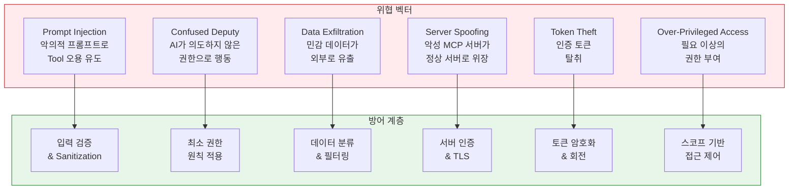
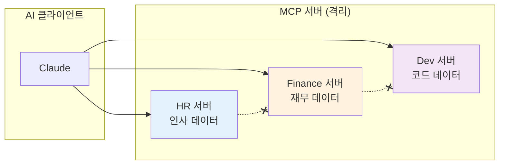
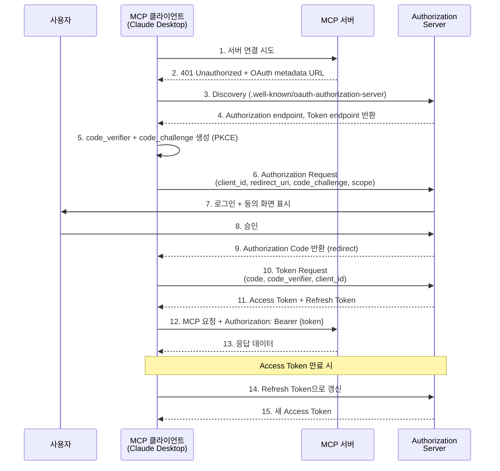
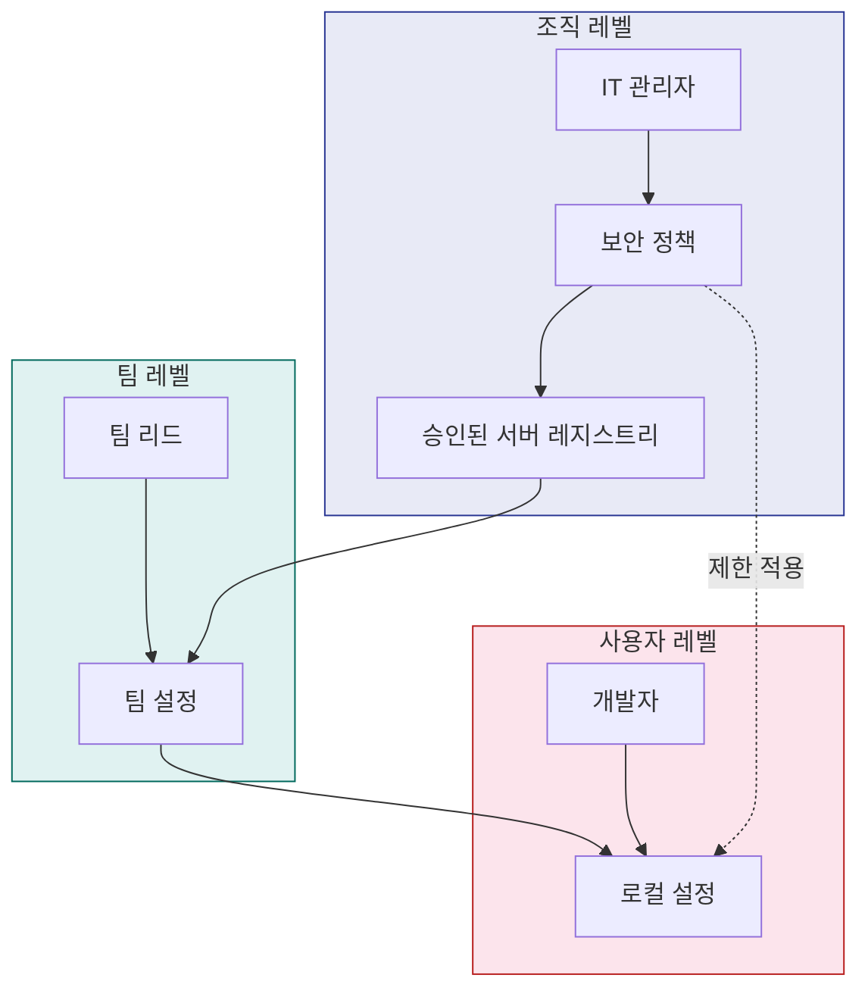
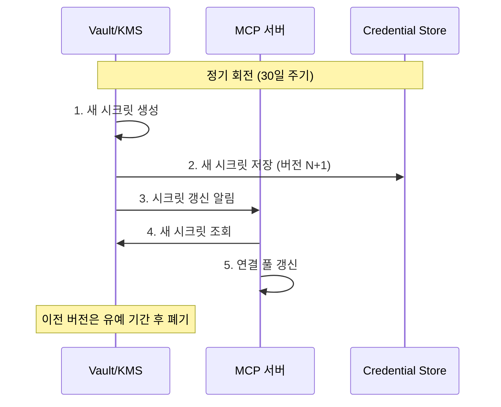
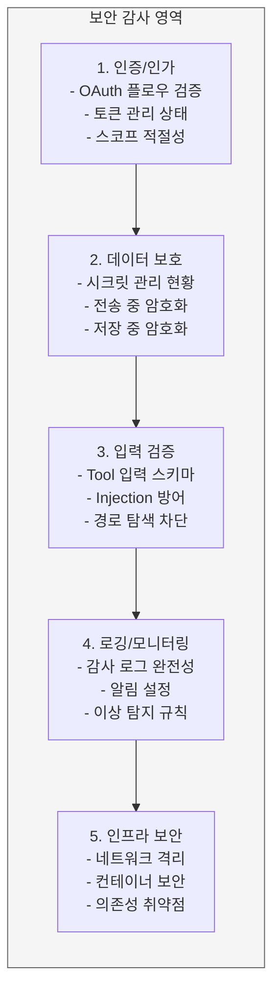

# MCP 보안 및 인증 가이드

> MCP 서버/클라이언트의 보안 모델, OAuth 2.0 인증, 시크릿 관리, 권한 설계를 다루는 종합 보안 가이드

---

## 목차

1. [MCP 보안 개요](#1-mcp-보안-개요)
2. [OAuth 2.0 인증 플로우](#2-oauth-20-인증-플로우)
3. [엔터프라이즈 보안 설정](#3-엔터프라이즈-보안-설정)
4. [시크릿 관리](#4-시크릿-관리)
5. [권한 스코프 설계](#5-권한-스코프-설계)
6. [보안 체크리스트](#6-보안-체크리스트)
7. [관련 문서 참조](#7-관련-문서-참조)

---

## 1. MCP 보안 개요

### 1.1 MCP 보안 모델 이해

MCP는 AI 어시스턴트가 외부 시스템에 접근하는 브릿지 역할을 한다. 이로 인해 전통적인 API 보안과 다른 고유한 위협이 존재한다:

- **AI가 중간 에이전트**: 사용자 → AI → MCP 서버 → 외부 시스템 경로에서 AI가 중간자 역할
- **동적 Tool 호출**: AI가 판단에 따라 Tool을 호출하므로 예측 불가능한 접근 패턴 발생
- **다중 서버 연결**: 하나의 AI 클라이언트가 여러 MCP 서버에 동시 연결 가능
- **사용자 동의 기반**: 모든 Tool 실행은 사용자의 명시적/묵시적 동의 필요

### 1.2 위협 모델



### 1.3 보안 원칙

#### 최소 권한 (Principle of Least Privilege)

각 MCP 서버와 Tool은 기능 수행에 필요한 최소한의 권한만 보유해야 한다.

```typescript
// BAD: 전체 데이터베이스 접근
server.tool("query", "SQL 실행", { sql: z.string() }, async ({ sql }) => {
  return db.execute(sql); // DDL, DML 모두 허용
});

// GOOD: 읽기 전용 + 허용 테이블 제한
server.tool("query", "승인된 테이블에서 데이터 조회", {
  table: z.enum(["products", "categories", "reviews"]),
  conditions: z.record(z.string()).optional(),
  limit: z.number().max(100).default(20),
}, async ({ table, conditions, limit }) => {
  return db.select(table, conditions, limit); // SELECT만 가능
});
```

#### 사용자 동의 (User Consent)

민감한 작업은 반드시 사용자의 명시적 동의를 받아야 한다. MCP 클라이언트(Claude Desktop 등)가 Tool 호출 전 사용자에게 확인을 요청한다.

```typescript
// Tool description에 부작용(side effect)을 명확히 기술
server.tool(
  "send-email",
  "이메일을 발송합니다. 실행 시 실제로 이메일이 전송됩니다.",
  { to: z.string().email(), subject: z.string(), body: z.string() },
  handler
);
```

#### 데이터 격리 (Data Isolation)

서로 다른 MCP 서버 간 데이터가 교차하지 않도록 격리한다.



---

## 2. OAuth 2.0 인증 플로우

### 2.1 Authorization Code Grant + PKCE

MCP는 원격 서버 접근 시 OAuth 2.0 Authorization Code Grant with PKCE를 표준 인증 방식으로 사용한다.



### 2.2 클라이언트 등록 및 Discovery

MCP 서버가 OAuth를 지원하려면 다음 엔드포인트를 제공해야 한다:

```typescript
// OAuth Discovery 엔드포인트
// GET /.well-known/oauth-authorization-server
app.get("/.well-known/oauth-authorization-server", (req, res) => {
  res.json({
    issuer: "https://mcp.example.com",
    authorization_endpoint: "https://mcp.example.com/authorize",
    token_endpoint: "https://mcp.example.com/token",
    registration_endpoint: "https://mcp.example.com/register",
    scopes_supported: ["read", "write", "admin"],
    response_types_supported: ["code"],
    grant_types_supported: ["authorization_code", "refresh_token"],
    code_challenge_methods_supported: ["S256"],
    token_endpoint_auth_methods_supported: ["none"], // Public Client
  });
});
```

**동적 클라이언트 등록 (RFC 7591)**:

```typescript
// POST /register - 동적 클라이언트 등록
app.post("/register", async (req, res) => {
  const { client_name, redirect_uris, grant_types, scope } = req.body;

  // 클라이언트 등록 검증
  if (!redirect_uris || redirect_uris.length === 0) {
    return res.status(400).json({ error: "redirect_uris 필수" });
  }

  // redirect_uri 검증: localhost 또는 custom scheme만 허용
  for (const uri of redirect_uris) {
    const parsed = new URL(uri);
    const isLocalhost =
      parsed.hostname === "localhost" || parsed.hostname === "127.0.0.1";
    const isCustomScheme = !["http:", "https:"].includes(parsed.protocol);

    if (!isLocalhost && !isCustomScheme) {
      return res.status(400).json({
        error: "redirect_uri는 localhost 또는 custom scheme이어야 합니다",
      });
    }
  }

  const clientId = crypto.randomUUID();

  // 클라이언트 정보 저장
  await db.saveClient({
    client_id: clientId,
    client_name,
    redirect_uris,
    grant_types: grant_types || ["authorization_code"],
    scope: scope || "read",
    created_at: new Date(),
  });

  res.status(201).json({
    client_id: clientId,
    client_name,
    redirect_uris,
    grant_types: grant_types || ["authorization_code"],
  });
});
```

### 2.3 토큰 관리

```typescript
// 토큰 발급
app.post("/token", async (req, res) => {
  const { grant_type, code, code_verifier, client_id, refresh_token } =
    req.body;

  if (grant_type === "authorization_code") {
    // Authorization Code 검증
    const authCode = await db.getAuthCode(code);
    if (!authCode || authCode.client_id !== client_id) {
      return res.status(400).json({ error: "invalid_grant" });
    }

    // PKCE 검증
    const expectedChallenge = base64url(sha256(code_verifier));
    if (expectedChallenge !== authCode.code_challenge) {
      return res.status(400).json({ error: "invalid_grant" });
    }

    // 토큰 발급
    const accessToken = await generateAccessToken(authCode.user_id, authCode.scope);
    const refreshToken = await generateRefreshToken(authCode.user_id, client_id);

    // 사용된 Authorization Code 삭제 (일회용)
    await db.deleteAuthCode(code);

    return res.json({
      access_token: accessToken,
      token_type: "Bearer",
      expires_in: 3600,
      refresh_token: refreshToken,
      scope: authCode.scope,
    });
  }

  if (grant_type === "refresh_token") {
    // Refresh Token 검증
    const tokenData = await db.getRefreshToken(refresh_token);
    if (!tokenData || tokenData.client_id !== client_id) {
      return res.status(400).json({ error: "invalid_grant" });
    }

    // 새 Access Token 발급
    const accessToken = await generateAccessToken(
      tokenData.user_id,
      tokenData.scope
    );

    // Refresh Token Rotation (선택적 보안 강화)
    const newRefreshToken = await generateRefreshToken(
      tokenData.user_id,
      client_id
    );
    await db.deleteRefreshToken(refresh_token);

    return res.json({
      access_token: accessToken,
      token_type: "Bearer",
      expires_in: 3600,
      refresh_token: newRefreshToken,
    });
  }

  res.status(400).json({ error: "unsupported_grant_type" });
});
```

### 2.4 MCP 서버에서 OAuth 미들웨어 구현

```typescript
// middleware/auth.ts
import { Request, Response, NextFunction } from "express";
import jwt from "jsonwebtoken";

interface TokenPayload {
  sub: string;       // 사용자 ID
  scope: string;     // 권한 스코프
  exp: number;       // 만료 시간
  iss: string;       // 발급자
}

export function requireAuth(requiredScope?: string) {
  return async (req: Request, res: Response, next: NextFunction) => {
    const authHeader = req.headers.authorization;

    if (!authHeader?.startsWith("Bearer ")) {
      return res.status(401).json({
        error: "unauthorized",
        message: "Bearer 토큰이 필요합니다",
      });
    }

    const token = authHeader.slice(7);

    try {
      const payload = jwt.verify(token, process.env.JWT_SECRET!) as TokenPayload;

      // 스코프 검증
      if (requiredScope) {
        const tokenScopes = payload.scope.split(" ");
        if (!tokenScopes.includes(requiredScope)) {
          return res.status(403).json({
            error: "insufficient_scope",
            message: `'${requiredScope}' 권한이 필요합니다`,
          });
        }
      }

      // 요청 객체에 사용자 정보 첨부
      (req as any).user = {
        id: payload.sub,
        scopes: payload.scope.split(" "),
      };

      next();
    } catch (error) {
      if (error instanceof jwt.TokenExpiredError) {
        return res.status(401).json({ error: "token_expired" });
      }
      return res.status(401).json({ error: "invalid_token" });
    }
  };
}
```

### 2.5 인증 콜백 처리

```typescript
// MCP 클라이언트 측 OAuth 콜백 핸들러
import http from "http";
import { URL } from "url";
import crypto from "crypto";

interface OAuthConfig {
  authorizationEndpoint: string;
  tokenEndpoint: string;
  clientId: string;
  redirectUri: string;
  scope: string;
}

async function performOAuthFlow(config: OAuthConfig): Promise<string> {
  // 1. PKCE 파라미터 생성
  const codeVerifier = crypto.randomBytes(32).toString("base64url");
  const codeChallenge = crypto
    .createHash("sha256")
    .update(codeVerifier)
    .digest("base64url");

  const state = crypto.randomBytes(16).toString("hex");

  // 2. Authorization URL 구성
  const authUrl = new URL(config.authorizationEndpoint);
  authUrl.searchParams.set("response_type", "code");
  authUrl.searchParams.set("client_id", config.clientId);
  authUrl.searchParams.set("redirect_uri", config.redirectUri);
  authUrl.searchParams.set("scope", config.scope);
  authUrl.searchParams.set("state", state);
  authUrl.searchParams.set("code_challenge", codeChallenge);
  authUrl.searchParams.set("code_challenge_method", "S256");

  // 3. 로컬 서버에서 콜백 대기
  return new Promise((resolve, reject) => {
    const server = http.createServer(async (req, res) => {
      const url = new URL(req.url!, `http://localhost`);

      if (url.pathname === "/callback") {
        const code = url.searchParams.get("code");
        const returnedState = url.searchParams.get("state");

        // State 검증
        if (returnedState !== state) {
          res.writeHead(400);
          res.end("State mismatch");
          reject(new Error("CSRF: state 불일치"));
          server.close();
          return;
        }

        if (!code) {
          res.writeHead(400);
          res.end("No code");
          reject(new Error("Authorization code 없음"));
          server.close();
          return;
        }

        // 4. Authorization Code → Access Token 교환
        try {
          const tokenRes = await fetch(config.tokenEndpoint, {
            method: "POST",
            headers: { "Content-Type": "application/x-www-form-urlencoded" },
            body: new URLSearchParams({
              grant_type: "authorization_code",
              code,
              code_verifier: codeVerifier,
              client_id: config.clientId,
              redirect_uri: config.redirectUri,
            }),
          });

          const tokenData = await tokenRes.json();

          res.writeHead(200, { "Content-Type": "text/html" });
          res.end("<html><body><h1>인증 완료</h1><p>이 창을 닫아도 됩니다.</p></body></html>");

          resolve(tokenData.access_token);
        } catch (err) {
          reject(err);
        } finally {
          server.close();
        }
      }
    });

    server.listen(0, () => {
      const port = (server.address() as any).port;
      console.error(`콜백 서버 시작: http://localhost:${port}/callback`);
      // 브라우저에서 인증 URL 열기
      console.error(`인증 URL: ${authUrl.toString()}`);
    });
  });
}
```

---

## 3. 엔터프라이즈 보안 설정

### 3.1 Managed Configuration

엔터프라이즈 환경에서는 관리자가 MCP 서버 설정을 중앙 관리할 수 있다.

```json
// managed_config.json - IT 관리자가 배포하는 설정
{
  "mcpServers": {
    "internal-api": {
      "command": "node",
      "args": ["/opt/mcp/internal-api-server/dist/index.js"],
      "env": {
        "API_ENDPOINT": "https://api.internal.company.com",
        "AUTH_MODE": "sso"
      }
    },
    "jira": {
      "command": "npx",
      "args": ["-y", "@company/mcp-jira-server"],
      "env": {
        "JIRA_URL": "https://company.atlassian.net",
        "JIRA_AUTH_METHOD": "oauth2"
      }
    }
  },
  "security": {
    "allowedServers": [
      "@company/*",
      "@modelcontextprotocol/*"
    ],
    "blockedServers": [
      "untrusted-*"
    ],
    "requireApproval": true,
    "maxConcurrentServers": 5
  }
}
```

### 3.2 조직 레벨 서버 관리



**설정 우선순위**: 조직 정책 > 팀 설정 > 사용자 로컬 설정

### 3.3 SSO 통합

```typescript
// SSO를 통한 MCP 서버 인증
import { McpServer } from "@modelcontextprotocol/sdk/server/mcp.js";

// SSO 토큰 검증 미들웨어
async function validateSSOToken(token: string): Promise<SSOUser | null> {
  try {
    // 조직의 Identity Provider에 토큰 검증 요청
    const response = await fetch("https://sso.company.com/api/validate", {
      method: "POST",
      headers: {
        "Content-Type": "application/json",
        "X-Service-Key": process.env.SSO_SERVICE_KEY!,
      },
      body: JSON.stringify({ token }),
    });

    if (!response.ok) return null;

    const user = await response.json();

    return {
      id: user.employee_id,
      email: user.email,
      department: user.department,
      roles: user.roles,
      groups: user.groups,
    };
  } catch {
    return null;
  }
}

interface SSOUser {
  id: string;
  email: string;
  department: string;
  roles: string[];
  groups: string[];
}
```

---

## 4. 시크릿 관리

### 4.1 환경변수를 통한 시크릿 전달

MCP 서버에 시크릿을 전달하는 기본 방식은 환경변수다.

```json
// claude_desktop_config.json
{
  "mcpServers": {
    "database": {
      "command": "node",
      "args": ["dist/index.js"],
      "env": {
        "DB_HOST": "localhost",
        "DB_PORT": "5432",
        "DB_USER": "app_user",
        "DB_PASSWORD": "secret-password",
        "DB_NAME": "myapp"
      }
    }
  }
}
```

서버에서 안전한 환경변수 읽기:

```typescript
// src/config.ts
interface ServerConfig {
  dbHost: string;
  dbPort: number;
  dbUser: string;
  dbPassword: string;
  dbName: string;
}

function loadConfig(): ServerConfig {
  const required = ["DB_HOST", "DB_USER", "DB_PASSWORD", "DB_NAME"];
  const missing = required.filter((key) => !process.env[key]);

  if (missing.length > 0) {
    console.error(`필수 환경변수 누락: ${missing.join(", ")}`);
    process.exit(1);
  }

  return {
    dbHost: process.env.DB_HOST!,
    dbPort: parseInt(process.env.DB_PORT || "5432", 10),
    dbUser: process.env.DB_USER!,
    dbPassword: process.env.DB_PASSWORD!,
    dbName: process.env.DB_NAME!,
  };
}

// 시크릿이 로그에 노출되지 않도록 주의
const config = loadConfig();
console.error(`DB 연결: ${config.dbHost}:${config.dbPort}/${config.dbName}`);
// NEVER: console.error(`Password: ${config.dbPassword}`);
```

### 4.2 시크릿 회전 전략



```typescript
// 시크릿 회전을 지원하는 설정 관리
class SecretManager {
  private cache = new Map<string, { value: string; expiresAt: number }>();
  private readonly ttlMs = 5 * 60 * 1000; // 5분 캐시

  async getSecret(key: string): Promise<string> {
    const cached = this.cache.get(key);
    if (cached && cached.expiresAt > Date.now()) {
      return cached.value;
    }

    // 실제 시크릿 저장소에서 조회
    const value = await this.fetchFromVault(key);

    this.cache.set(key, {
      value,
      expiresAt: Date.now() + this.ttlMs,
    });

    return value;
  }

  private async fetchFromVault(key: string): Promise<string> {
    // HashiCorp Vault 예시
    const response = await fetch(
      `${process.env.VAULT_ADDR}/v1/secret/data/${key}`,
      {
        headers: { "X-Vault-Token": process.env.VAULT_TOKEN! },
      }
    );
    const data = await response.json();
    return data.data.data.value;
  }

  // 캐시 강제 무효화 (시크릿 회전 시)
  invalidate(key: string) {
    this.cache.delete(key);
  }

  invalidateAll() {
    this.cache.clear();
  }
}
```

### 4.3 .env 파일 보안

```bash
# .env 파일은 반드시 .gitignore에 추가
echo ".env" >> .gitignore
echo ".env.local" >> .gitignore
echo ".env.*.local" >> .gitignore

# .env.example은 커밋 (실제 값 없이 키만 포함)
```

```bash
# .env.example
DB_HOST=localhost
DB_PORT=5432
DB_USER=
DB_PASSWORD=
DB_NAME=
API_KEY=
```

```bash
# .env (절대 커밋하지 않음)
DB_HOST=prod-db.internal.company.com
DB_PORT=5432
DB_USER=mcp_service
DB_PASSWORD=Str0ng!P@ssw0rd#2024
DB_NAME=production
API_KEY=sk-live-abc123xyz
```

> **중요**: `.env` 파일이 실수로 커밋된 경우, 파일을 삭제하는 것만으로는 부족하다. Git 히스토리에 남아있으므로 시크릿을 즉시 회전해야 한다.

---

## 5. 권한 스코프 설계

### 5.1 Tool 단위 권한 제어

```typescript
// Tool에 필요한 권한을 메타데이터로 정의
interface ToolPermission {
  tool: string;
  requiredScopes: string[];
  riskLevel: "low" | "medium" | "high";
}

const toolPermissions: ToolPermission[] = [
  { tool: "list-items", requiredScopes: ["read"], riskLevel: "low" },
  { tool: "get-item", requiredScopes: ["read"], riskLevel: "low" },
  { tool: "create-item", requiredScopes: ["write"], riskLevel: "medium" },
  { tool: "update-item", requiredScopes: ["write"], riskLevel: "medium" },
  { tool: "delete-item", requiredScopes: ["write", "delete"], riskLevel: "high" },
  { tool: "admin-reset", requiredScopes: ["admin"], riskLevel: "high" },
];

// Tool 실행 전 권한 검증
function checkPermission(
  toolName: string,
  userScopes: string[]
): { allowed: boolean; reason?: string } {
  const perm = toolPermissions.find((p) => p.tool === toolName);
  if (!perm) {
    return { allowed: false, reason: "알 수 없는 Tool" };
  }

  const missingScopes = perm.requiredScopes.filter(
    (s) => !userScopes.includes(s)
  );

  if (missingScopes.length > 0) {
    return {
      allowed: false,
      reason: `필요 권한: ${missingScopes.join(", ")}`,
    };
  }

  return { allowed: true };
}
```

### 5.2 읽기/쓰기 분리

```typescript
// 읽기 전용 서버와 쓰기 서버를 분리
// read-only-server.ts
const readServer = new McpServer({
  name: "data-reader",
  version: "1.0.0",
});

readServer.tool("list-users", "사용자 목록 조회", {}, async () => {
  const users = await db.query("SELECT id, name, email FROM users");
  return { content: [{ type: "text", text: JSON.stringify(users) }] };
});

readServer.tool(
  "get-report",
  "보고서 조회",
  { reportId: z.string() },
  async ({ reportId }) => {
    const report = await db.query("SELECT * FROM reports WHERE id = ?", [reportId]);
    return { content: [{ type: "text", text: JSON.stringify(report) }] };
  }
);

// write-server.ts (별도 프로세스, 별도 인증)
const writeServer = new McpServer({
  name: "data-writer",
  version: "1.0.0",
});

writeServer.tool(
  "create-user",
  "새 사용자를 생성합니다. 관리자 권한이 필요합니다.",
  {
    name: z.string(),
    email: z.string().email(),
    role: z.enum(["viewer", "editor", "admin"]),
  },
  async ({ name, email, role }) => {
    // 쓰기 작업에는 추가 감사 로그 기록
    const result = await db.insert("users", { name, email, role });
    await auditLog.write({
      action: "CREATE_USER",
      target: email,
      timestamp: new Date(),
    });
    return { content: [{ type: "text", text: `사용자 생성: ${email}` }] };
  }
);
```

### 5.3 스코프 정의 모범 사례

| 스코프 | 설명 | 허용 작업 |
|--------|------|-----------|
| `read` | 데이터 읽기 | SELECT, 목록 조회, 상세 조회 |
| `write` | 데이터 생성/수정 | INSERT, UPDATE |
| `delete` | 데이터 삭제 | DELETE, 소프트 삭제 |
| `admin` | 관리 작업 | 설정 변경, 사용자 관리 |
| `execute` | 명령 실행 | 외부 API 호출, 작업 트리거 |

```typescript
// 세밀한 스코프 설계 예시
const SCOPES = {
  // 리소스별 세분화
  "users:read": "사용자 정보 읽기",
  "users:write": "사용자 생성/수정",
  "users:delete": "사용자 삭제",
  "reports:read": "보고서 읽기",
  "reports:write": "보고서 생성/수정",
  "settings:read": "설정 읽기",
  "settings:write": "설정 변경",
  // 와일드카드
  "users:*": "사용자 전체 권한",
  "*:read": "모든 리소스 읽기",
} as const;
```

---

## 6. 보안 체크리스트

### 6.1 개발 단계 체크리스트

| # | 항목 | 설명 |
|---|------|------|
| 1 | **입력 검증** | 모든 Tool 입력에 대해 Zod/Pydantic 스키마로 검증 |
| 2 | **SQL Injection 방지** | 파라미터 바인딩 사용, 문자열 연결 금지 |
| 3 | **Path Traversal 방지** | 파일 경로의 `../` 탐색 차단, `resolve()` 후 베이스 디렉토리 확인 |
| 4 | **Command Injection 방지** | `child_process.exec` 대신 `execFile` 사용, 셸 확장 차단 |
| 5 | **에러 메시지 최소화** | 스택 트레이스, 내부 경로 등 민감 정보 노출 금지 |
| 6 | **시크릿 하드코딩 금지** | API Key, 비밀번호 등을 소스 코드에 포함하지 않음 |
| 7 | **의존성 취약점 검사** | `npm audit` / `pip audit` 실행 |
| 8 | **최소 권한 Tool 설계** | 각 Tool이 필요 최소한의 권한만 사용 |
| 9 | **부작용 명시** | Tool description에 쓰기/삭제/전송 등 부작용을 명확히 기술 |
| 10 | **로깅에 시크릿 제외** | 환경변수, 토큰, 비밀번호가 로그에 출력되지 않는지 확인 |
| 11 | **타입 안전성** | TypeScript strict 모드, Python 타입 힌트 적용 |
| 12 | **stdout 보호** | 디버그 출력을 stderr로 분리 (stdout은 MCP 통신 채널) |

### 6.2 배포 단계 체크리스트

| # | 항목 | 설명 |
|---|------|------|
| 1 | **TLS 적용** | SSE/HTTP Transport 사용 시 HTTPS 필수 |
| 2 | **시크릿 외부 관리** | 환경변수 또는 Vault를 통한 시크릿 주입 |
| 3 | **Docker 비루트 실행** | 컨테이너를 비루트 사용자로 실행 |
| 4 | **네트워크 격리** | 불필요한 아웃바운드 트래픽 차단 |
| 5 | **이미지 스캐닝** | 컨테이너 이미지의 CVE 취약점 검사 |
| 6 | **.env 파일 제외** | `.gitignore`에 `.env` 포함 확인 |
| 7 | **의존성 고정** | `package-lock.json` / `uv.lock` 커밋 |
| 8 | **최소 베이스 이미지** | Alpine 등 최소 이미지 사용 |
| 9 | **헬스 체크** | 서버 상태 확인 엔드포인트 구성 |
| 10 | **리소스 제한** | CPU/메모리 제한 설정 (Docker 또는 systemd) |
| 11 | **CORS 설정** | SSE 사용 시 허용 오리진 제한 |
| 12 | **Rate Limiting** | Tool 호출 빈도 제한 적용 |

### 6.3 운영 단계 체크리스트

| # | 항목 | 설명 |
|---|------|------|
| 1 | **접근 로그 기록** | 모든 Tool 호출을 감사 로그로 기록 |
| 2 | **이상 탐지** | 비정상적인 호출 패턴 모니터링 |
| 3 | **시크릿 회전** | 정기적인 시크릿/토큰 교체 (30~90일) |
| 4 | **의존성 업데이트** | 보안 패치 적용 (Dependabot/Renovate) |
| 5 | **토큰 만료 관리** | Access Token 만료 및 Refresh Token 갱신 확인 |
| 6 | **백업 및 복구** | 설정/데이터 백업 전략 수립 |
| 7 | **인시던트 대응** | 보안 사고 시 대응 절차 문서화 |
| 8 | **권한 리뷰** | 분기별 서버 권한 및 스코프 재검토 |
| 9 | **로그 보존** | 감사 로그 보존 기간 준수 (최소 1년) |
| 10 | **침투 테스트** | 정기적인 보안 테스트 수행 |
| 11 | **가용성 모니터링** | 서버 응답 시간 및 에러율 모니터링 |
| 12 | **버전 관리** | SDK 및 서버 버전 최신 상태 유지 |

### 6.4 보안 감사 가이드

정기 보안 감사 시 다음 영역을 점검한다:



**감사 보고서 양식:**

```markdown
## MCP 서버 보안 감사 보고서

**대상**: [서버 이름]
**감사일**: [날짜]
**감사자**: [이름]

### 1. 요약
- 전체 점검 항목: [N]개
- 통과: [N]개 / 미흡: [N]개 / 심각: [N]개

### 2. 발견 사항
| 등급 | 항목 | 설명 | 권고 조치 | 기한 |
|------|------|------|-----------|------|
| 심각 | [항목] | [설명] | [조치] | [기한] |

### 3. 이전 감사 조치 이행 현황
| 항목 | 상태 | 비고 |
|------|------|------|

### 4. 다음 감사 예정일: [날짜]
```

---

## 7. 관련 문서 참조

| 문서 | 설명 |
|------|------|
| [MCP 종합 가이드 (README.md)](./README.md) | MCP 프로토콜 개요, 아키텍처, 설정 방법 |
| [MCP 서버 개발 가이드 (01)](./01-MCP-서버-개발-가이드.md) | TypeScript/Python SDK로 커스텀 서버 개발 |

---

> **참고**: 이 문서는 MCP 보안 모범 사례를 기준으로 작성되었다. 조직의 보안 정책에 따라 추가 요구사항이 있을 수 있으므로, 사내 보안팀과 협의하여 적용한다. 최신 보안 권고사항은 공식 문서([modelcontextprotocol.io](https://modelcontextprotocol.io))를 참고한다.
